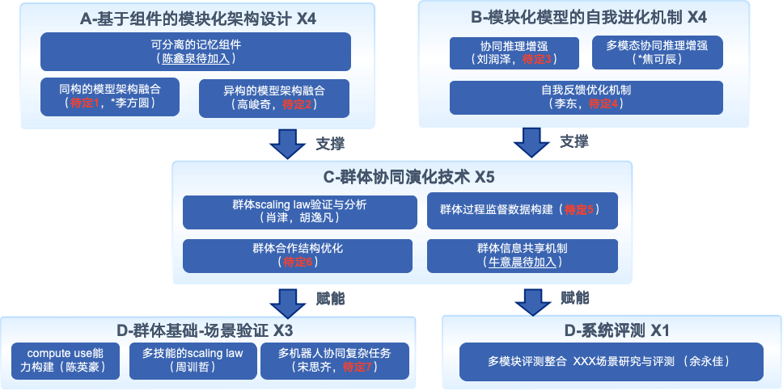

<!-- 页面内容默认隐藏 -->

# Qi-Group (Shanghai AI Lab)

    🏠 <a href="https://github.com/unsosp1ro/unsosp1ro.github.io">Home Page</a>  |   🤗 <a href="https://github.com/unsosp1ro/unsosp1ro.github.io">Model</a>  |   📊 <a href="https://github.com/unsosp1ro/unsosp1ro.github.io">Dataset</a>  |   📄 <a href="https://github.com/unsosp1ro/unsosp1ro.github.io">Paper</a> 

## TODO 

每个具体研究内容的更新
每个方向都有自己的paper list和最新进展

## 团队目标和使命
对齐目标和阶段性产出
并完成良好的认知、科研进度和内容管理

OKR： 

|                             **项目指标**                             |    **研究方向**    | **benchmark** |
| :------------------------------------------------------------------: | :----------------: | :-----------: |
| 指标1：提出不少于2条高价值scaling law提升的insight和模型架构选型结论 | C-大模型物理学基础 |       %       |
|                 指标2：多个模型合作超越70B的模型/ O1                 |     A-模型融合     |               |
|                                                                      |     B-在线进化     |               |
|                                                                      |    C-自组织优化    |               |
|         指标2：skill层面scaling law验证，并在机器人场景验证          |     D-场景评估     |               |
|                       指标3：群体评估与工具包                        |     D-评测工具     |               |

## 通专融合技术体系
### OKR

### 通专融合模型与基础理论
#### Objective
- KR1:
- KR2:
- KR3:
#### 团队成员与分工
- 高峻奇
- 李鹏飞
- 邹翔

### 模型架构设计与训练
#### 团队成员与分工 
- 
-

### 通专驱动多智能体系统
### 团队成员与分工

# 通专驱动科学与具生应用
### 团队成员与分工

<table border="1">
  <tr>
    <th></th>
    <th>目标性成果</th>
    <th>团队分工</th>
    <th>子课题</th>
    <th>论文清单</th>
    <th>实验进展</th>
    <th>工具和仓库</th>
  </tr>
  <tr>
    <th>A通专融合基础理论</th>
    <th></th>
    <th></th>
    <th><a href="https://github.com/shlab-qigroup/shlab-qigroup.github.io/blob/main/site/A%E9%80%9A%E4%B8%93%E8%9E%8D%E5%90%88%E5%9F%BA%E7%A1%80%E7%90%86%E8%AE%BA/%E5%AD%A6%E7%90%86%E6%9E%84%E5%BB%BA%E4%B8%8E%E5%9F%BA%E7%A1%80.md">学理构建与基础</a></th>
    <th></th>
    <th></th>
    <th></th>
  </tr>
  <tr>
    <th rowspan="3">B通专模型架构设计</th>
    <th rowspan="3"></th>
    <th rowspan="3">s</th>
    <th><a href="https://github.com/shlab-qigroup/shlab-qigroup.github.io/blob/main/site/B%E9%80%9A%E4%B8%93%E6%A8%A1%E5%9E%8B%E6%9E%B6%E6%9E%84%E8%AE%BE%E8%AE%A1/%E6%B7%B7%E5%90%88%E6%9E%B6%E6%9E%84.md">混合架构</a></th>
    <th rowspan="3">a</th>
    <th rowspan="3">b</th>
    <th rowspan="3">d</th>
  </tr>
  <tr>
    <th><a href="https://github.com/shlab-qigroup/shlab-qigroup.github.io/blob/main/site/B%E9%80%9A%E4%B8%93%E6%A8%A1%E5%9E%8B%E6%9E%B6%E6%9E%84%E8%AE%BE%E8%AE%A1/%E6%A8%A1%E5%9E%8B%E9%A2%84%E8%AE%AD%E7%BB%83.md">模型预训练</a></th>
  </tr>
  <tr>
    <th><a href="https://github.com/shlab-qigroup/shlab-qigroup.github.io/blob/main/site/B%E9%80%9A%E4%B8%93%E6%A8%A1%E5%9E%8B%E6%9E%B6%E6%9E%84%E8%AE%BE%E8%AE%A1/%E6%A8%A1%E5%9E%8B%E8%83%BD%E5%8A%9B%E5%A2%9E%E5%BC%BA.md">模型能力增强</a></th>
  </tr>
  <tr>
    <th rowspan="4">通专驱动多智能体技术</th>
    <th rowspan="4"></th>
    <th rowspan="4"></th>
    <th><a href="https://github.com/shlab-qigroup/shlab-qigroup.github.io/blob/main/site/%E9%80%9A%E4%B8%93%E9%A9%B1%E5%8A%A8%E5%A4%9A%E6%99%BA%E8%83%BD%E4%BD%93%E6%8A%80%E6%9C%AF/%E7%BE%A4%E4%BD%93%E7%89%A9%E7%90%86%E5%AD%A6%E5%9F%BA%E7%A1%80.md">群体物理学基础</a></th>
    <th rowspan="4"></th>
    <th rowspan="4"></th>
    <th rowspan="4"></th>
  </tr>
  <tr>
    <th><a href="https://github.com/shlab-qigroup/shlab-qigroup.github.io/blob/main/site/%E9%80%9A%E4%B8%93%E9%A9%B1%E5%8A%A8%E5%A4%9A%E6%99%BA%E8%83%BD%E4%BD%93%E6%8A%80%E6%9C%AF/%E5%90%8C%E6%9E%84%E5%BC%82%E6%9E%84%E6%A8%A1%E5%9E%8B%E8%9E%8D%E5%90%88.md">同构异构模型融合</a></th>
  </tr>
  <tr>
    <th><a href="https://github.com/shlab-qigroup/shlab-qigroup.github.io/blob/main/site/%E9%80%9A%E4%B8%93%E9%A9%B1%E5%8A%A8%E5%A4%9A%E6%99%BA%E8%83%BD%E4%BD%93%E6%8A%80%E6%9C%AF/%E8%81%94%E5%90%88%E6%8E%A8%E7%90%86%E4%B8%8E%E8%BF%9B%E5%8C%96.md">联合推理与进化</a></th>
  </tr>
  <tr>
    <th><a href="https://github.com/shlab-qigroup/shlab-qigroup.github.io/blob/main/site/%E9%80%9A%E4%B8%93%E9%A9%B1%E5%8A%A8%E5%A4%9A%E6%99%BA%E8%83%BD%E4%BD%93%E6%8A%80%E6%9C%AF/%E8%87%AA%E7%BB%84%E7%BB%87%E4%BC%98%E5%8C%96.md">自组织优化</a></th>
  </tr>
  <tr>
    <th rowspan="2">通专驱动科学与具生应用</th>
    <th rowspan="2"></th>
    <th rowspan="2"></th>
    <th><a href="https://github.com/shlab-qigroup/shlab-qigroup.github.io/blob/main/site/%E9%80%9A%E4%B8%93%E9%A9%B1%E5%8A%A8%E7%A7%91%E5%AD%A6%E4%B8%8E%E5%85%B7%E7%94%9F%E5%BA%94%E7%94%A8/%E8%AE%A1%E7%AE%97%E5%8C%96%E5%AD%A6%E5%9C%BA%E6%99%AF.md">计算化学场景</a></th>
    <th rowspan="3"></th>
    <th rowspan="3"></th>
    <th rowspan="3"></th>
  </tr>
  <tr>
    <th><a href="https://github.com/shlab-qigroup/shlab-qigroup.github.io/blob/main/site/%E9%80%9A%E4%B8%93%E9%A9%B1%E5%8A%A8%E7%A7%91%E5%AD%A6%E4%B8%8E%E5%85%B7%E7%94%9F%E5%BA%94%E7%94%A8/%E5%A4%9A%E6%9C%BA%E5%99%A8%E4%BA%BA%E6%94%B6%E6%8B%BE%E8%A1%8C%E6%9D%8E%E7%AE%B1%E4%BB%BB%E5%8A%A1.md">多机器人收拾行李箱任务</a></th>
  </tr>
</table>

 <!-- 结束 protected-content div -->
