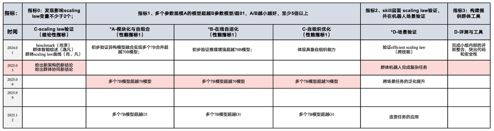
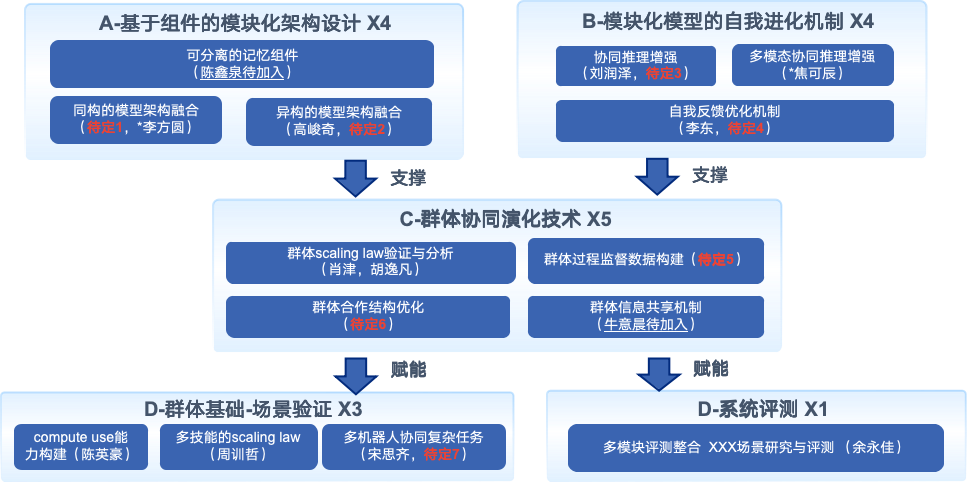

<!-- 页面内容默认隐藏 -->

# Qi-Group (Shanghai AI Lab)

    🏠 <a href="https://github.com/unsosp1ro/unsosp1ro.github.io">Home Page</a>  |   🤗 <a href="https://github.com/unsosp1ro/unsosp1ro.github.io">Model</a>  |   📊 <a href="https://github.com/unsosp1ro/unsosp1ro.github.io">Dataset</a>  |   📄 <a href="https://github.com/unsosp1ro/unsosp1ro.github.io">Paper</a> 

## TODO 
分页维护
每个方向一页
每个具体研究内容的更新
每个方向都有自己的paper list和最新进展

## About

You can edit this page using Markdown syntax.

## 群体智能系统与关键技术研究

|                             **项目指标**                             |    **研究方向**    | **benchmark** |
| :------------------------------------------------------------------: | :----------------: | :-----------: |
| 指标1：提出不少于2条高价值scaling law提升的insight和模型架构选型结论 | C-大模型物理学基础 |       %       |
|                 指标2：多个模型合作超越70B的模型/ O1                 |     A-模型融合     |               |
|                                                                      |     B-在线进化     |               |
|                                                                      |    C-自组织优化    |               |
|         指标2：skill层面scaling law验证，并在机器人场景验证          |     D-场景评估     |               |
|                       指标3：群体评估与工具包                        |     D-评测工具     |               |

### 模型融合  高峻奇

| 模型/方法  | 常识推理    | 数学推理 |      | 综合学科表现 |        | 代码能力        | 困难推理      |                |
| ---------- | ----------- | -------- | ---- | ------------ | ------ | --------------- | ------------- | -------------- |
|            | CommonSense | GSM8K    | MATH | MMLU         | GAOKAO | HumanEval-Multi | ARC-Challenge | Big-Bench-Hard |
| O1         |             |          |      |              |        |                 |               |                |
| 70B模型    |             |          |      |              |        |                 |               |                |
| 最新的方法 |             |          |      |              |        |                 |               |                |
| 我们的方法 |             |          |      |              |        |                 |               |                |

## 自进化技术

### 协同推理增强  刘润泽

| **模型**                 | **推理方法**               | **MATH 500** | ****    | ****   | ****    | ****    | ****    | **GSM8K** |
|------------------------|------------------------|--------------|---------|--------|---------|---------|---------|-----------|
|                        |                        | Level 1      | Level 2 | Level 3 | Level 4 | Level 5 | Average |           |
| o1-mini                | Zero-shot CoT          |              |         |        |         |         | 90      |           |
| o1-preview             | Zero-shot CoT          |              |         |        |         |         | 85.5    |           |
| Llama-3.1-8B-Instruct  | Bo2                    |              |         |        |         |         |         |           |
|                        | Bo8                    |              |         |        |         |         |         |           |
|                        | Bo32                   |              |         |        |         |         |         |           |
|                        | Bo128                  |              |         |        |         |         |         |           |
|                        | Beam Search + PRM@2    | 55.8         | 47.8    | 54.3   | 53.9    | 48.5    | 51.6    |           |
|                        | Beam Search + PRM@8    | 67.4         | 52.2    | 66.7   | 63.3    | 58.2    | 61      |           |
|                        | Beam Search + PRM@32   | 74.4         | 55.6    | 70.5   | 64.8    | 64.9    | 65.2    |           |
|                        | Beam Search + PRM@128  | 72.1         | 63.3    | 70.5   | 63.3    | 67.2    | 66.6    |           |
|                        | Beam Search + Pass@2   |              |         |        |         |         | 60.2    |           |
|                        | Beam Search + Pass@8   |              |         |        |         |         | 77.2    |           |
|                        | Beam Search + Pass@32  |              |         |        |         |         | 86.6    |           |
|                        | Beam Search + Pass@128 |              |         |        |         |         | 91.4    |           |
|                        | MCTS@2                 |              |         |        |         |         |         |           |
|                        | MCTS@8                 |              |         |        |         |         |         |           |
|                        | MCTS@32                |              |         |        |         |         |         |           |
|                        | MCTS@128               |              |         |        |         |         |         |           |
| Llama-3.1-70B-Instruct | Zero-shot CoT          | 72.1         | 80      | 62.9   | 46.9    | 23.1    | 52      |           |
|                        | Beam Search + PRM@1    |              |         |        |         |         | 62.6    |           |

### 多模态协同推理增强 焦可辰

### 自我反馈优化机制 李东

#### benchmark1——multi-agent方法评估

| **模型/方法**             | **数学能力** |      | **代码生成能力** | **常识推理能力** |            |
| ------------------------- | ------------ | ---- | ---------------- | ---------------- | ---------- |
|                           | GSM8K        | Math | HumanEval        | MMLU             | StrategyQA |
| O1                        |              |      |                  |                  |            |
| 70B模型                   |              |      |                  |                  |            |
| LLM-Debate                |              |      |                  |                  |            |
| Corex                     |              |      |                  |                  |            |
| Autoagents                |              |      |                  |                  |            |
| Dynamic llm-agent network |              |      |                  |                  |            |
| GPTSwarm                  |              |      |                  |                  |            |
| AutoGen                   |              |      |                  |                  |            |
| 我们的方法                |              |      |                  |                  |            |

#### benchmark2——现有自我反馈方法的评估

| **模型/方法** | **通用语言任务** | **数学能力** | **Sequential decision making** | **多轮交互能力** | **推理能力** |
| ------------- | ---------------- | ------------ | ------------------------------ | ---------------- | ------------ |
|               | MMLU             | GSM8K        | ALFWorld                       | AgentBench       | HotpotQA     |
| O1            |                  |              |                                |                  |              |
| 70B模型       |                  |              |                                |                  |              |
| ReAct         |                  |              |                                |                  |              |
| reflexion     |                  |              |                                |                  |              |
| self-refine   |                  |              |                                |                  |              |
| Expel         |                  |              |                                |                  |              |
| SELFCHECK     |                  |              |                                |                  |              |
| 我们的方法    |                  |              |                                |                  |              |

### 群体协同演绎

-  scaling law的分析  肖津和逸凡
-  过程监督数据构建  待定
-  群体合作结构优化  待定
-  群体信息共享机制  李东

### 场景验证

#### Compute use能力评估 陈英豪

| **模型/方法** | **OS 任务操作** | **** | **** | **** | **** |
| ------------- | --------------- | ---- | ---- | ---- | ---- |
|               | OSworld         |      |      |      |      |
| O1            |                 |      |      |      |      |  |  |
| 70B模型       |                 |      |      |      |      |  |  |  |  |  |
| 最新的方法    |                 |      |      |      |      |  |  |  |  |  |
| 我们的方法    |                 |      |      |      |      |

#### 多技能scaling law评估 周训哲

#### 多机器人合作场景 宋思齐

## 通专融合基础模型架构设计

> 通专融合与交叉应用

### 知识推理解耦新架构设计

- 组件预训练 待定
- 推理预训练 程爽
- 联合优化训练 待定

### 专业模型预训练，对齐微调 刘大卫

### 模型能力增强 

- 长序列建模与增强 李昱莹
- COT隐式优化与增强 李鹏飞
- 量化优化与部署 刘大卫
- 多模态增强  待定

### 计算化学-场景验证

- Compute use能力构建 陈学添、陈英豪
- 专业软件应用优化 李东

## 科学智能与具生智能应用

 <!-- 结束 protected-content div -->
